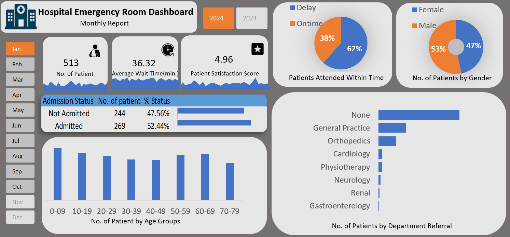

# Hospital Emergency Room Dashboard

## Project Overview
This project analyzes hospital emergency room data using Excel.

##  Objectives
- Track patient flow
- Analyze waiting time
- Identify peak hours
- Improve hospital efficiency

##  Dataset
- Source: Sample hospital data
- Records: 5000

##  Tools Used
- Microsoft Excel
- Pivot Tables
- Charts
- Data Cleaning

##  Dashboard Features
- Patient count analysis
- Waiting time trends
- Department-wise distribution
- Peak hour analysis

##  Dashboard Preview

##  Key Insights
- Peak hours occur between X–Y
- Average waiting time is X minutes
- Most patients visit department X

##  Conclusion
This dashboard helps in improving decision-making for hospital management.# hospital-emergency-room-dashboard
Excel dashboard analyzing hospital emergency room data
